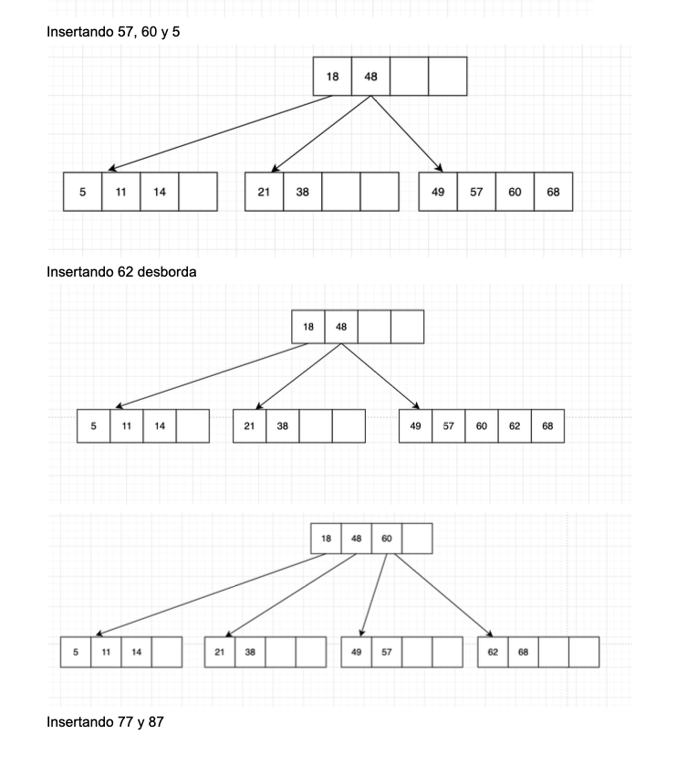
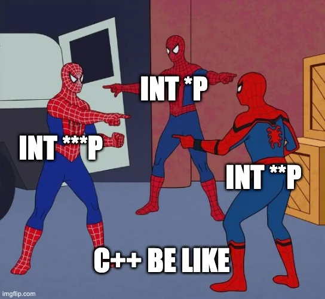
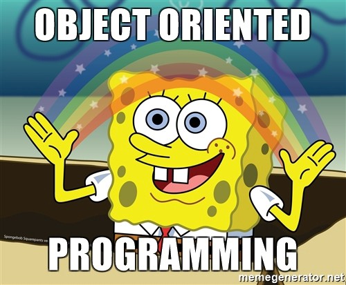
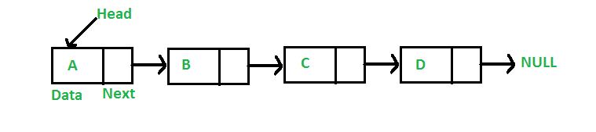

# Curso introductorio de Estructura de Datos
El objetivo de este curso es brindar los conocimientos necesarios para poder llevar la **primera mitad** del curso de manera tranquila y sin mucho esfuerzo 🤓. 
- [Curso introductorio de Estructura de Datos](#curso-introductorio-de-estructura-de-datos)
  - [Semana 1: Introducción, nociones previas y listas enlazadas simples](#semana-1-introducción-nociones-previas-y-listas-enlazadas-simples)
    - [¿Por qué solo la primera mitad del curso?](#por-qué-solo-la-primera-mitad-del-curso)
    - [Nociones previas](#nociones-previas)
      - [Punteros](#punteros)
        - [¿Qué es un puntero?](#qué-es-un-puntero)
        - [¿Para qué me sirve un puntero](#para-qué-me-sirve-un-puntero)
        - [Sintaxis de un puntero](#sintaxis-de-un-puntero)
      - [Structs](#structs)
        - [¿Qué es un Struct?](#qué-es-un-struct)
        - [Sintaxis de un Struct](#sintaxis-de-un-struct)
        - [Declarando un Struct](#declarando-un-struct)
      - [Structs y punteros](#structs-y-punteros)
    - [Listas enlazadas simples](#listas-enlazadas-simples)
      - [¿Qué es una lista enlazada?](#qué-es-una-lista-enlazada)
  - [Semana 2: Listas enlazadas dobles](#semana-2-listas-enlazadas-dobles)
  - [Semana 3: Listas circulares](#semana-3-listas-circulares)
  - [Semana 4: Pilas y Colas](#semana-4-pilas-y-colas)
  - [Semana 5: Métodos de Ordenamiento y de búsqueda](#semana-5-métodos-de-ordenamiento-y-de-búsqueda)

## Semana 1: Introducción, nociones previas y listas enlazadas simples
### ¿Por qué solo la primera mitad del curso?
En la segunda mitad del curso se estudian lo que son las estructuras **no lineales**, o en otras palabras, **árboles y grafos**. Esto se ve de manera **teórica** principalemente. No se ve su implementación en código, y los ejercicios que plantean los profesores son algo parecido a lo siguiente:
  
En ese sentido, tiene más sentido dedicar este curso a la primera mitad del ciclo, ya que -desde mi punto de vista- es la más difícil y, si asegurás tu nota con esta parte, con la segunda ya te preocupas por ponderar no más 🤓
### Nociones previas
#### Punteros
  
#####  ¿Qué es un puntero?
Además de ser el motivo por el que jalaste Algoritmica I, un puntero es una variable que almacena la **dirección de memoria** de otra variable.  
##### ¿Para qué me sirve un puntero
Haciendo uso de ellos, podemos: 
- Referenciar y acceder al valor contenido en la dirección de memoria (Función principal)
- Hacer uso de la memoria *heap* mediante el operador **new** para crear variables de manera dinámica (Crucial determinante para este curso)  
##### Sintaxis de un puntero

```c++
    int *puntero = &variable
```
**Vista gráfica**
  
**Accediendo al valor en la dirección de memoria de un puntero**
```c++
    int num = 10;
    cout<<num; //10
    int *num_ptr = &num
    *num_ptr = 20
    cout<<num; //20
```
#### Structs
  
##### ¿Qué es un Struct?  
En C++, un *struct* es un tipo de dato, definido por un usuario, que agrupa variables y/o funciones (métodos) de diferente tipo.  
##### Sintaxis de un Struct

```c++
    struct Perro {
        // Variables
        string nombre;
        int edad;
        // Métodos
        void ladrar();
        void comer();
    }
```
##### Declarando un Struct
```c++
    Perro perrito;
    perrito.nombre = "Barbas";
    perrito.edad = 5;
    perrito.ladrar();
```
#### Structs y punteros
En C++ es posible usar punteros que "apunten" a Structs.  
**¿Para qué nos sirve eso?**  Para crear structs de manera **dinámica** mediante el operador *new*.  
**Ejemplo**
```c++
    Perro * perrito = new Perro();
    delete perrito;
```
Sin embargo, al usar punteros a structs, si queremos acceder a las variables y/o métodos que contienen, debemos hacer uso del *arrow operator* (->).  
**Sin puntero**
```c++
    Perro perrito;
    perrito.nombre = "Barbas";
    perrito.edad = 5;
    perrito.ladrar();
```
**Con puntero**
```c++
    Perro perrito;
    perrito->nombre = "Barbas";
    perrito->edad = 5;
    perrito->ladrar();
```
### Listas enlazadas simples
#### ¿Qué es una lista enlazada?
Una lista enlazada es una **estructura de datos** dinámica usada para almacenar grupos de datos. Cada elemento de una lista es llamado **nodo**, el cuál consta de dos partes (en una lista simple):
1. Valor del nodo
2. Puntero al siguiente nodo  
   
**Nota**: El valor de un nodo puede ser cualquier tipo de variable (int, char, float) e incluso **objetos**.

**Vista gráfica**

Para poder usar una lista enlazada, antes debemos definir un objeto **Nodo** que contenga lo antes mencionado.  
Veremos las siguientes operaciones en listas enlazadas:  
   1. Creación
   2. Inserción
   3. Eliminación
   4. Busqueda
   5. Mostrar
   
## Semana 2: Listas enlazadas dobles
## Semana 3: Listas circulares
## Semana 4: Pilas y Colas
## Semana 5: Métodos de Ordenamiento y de búsqueda